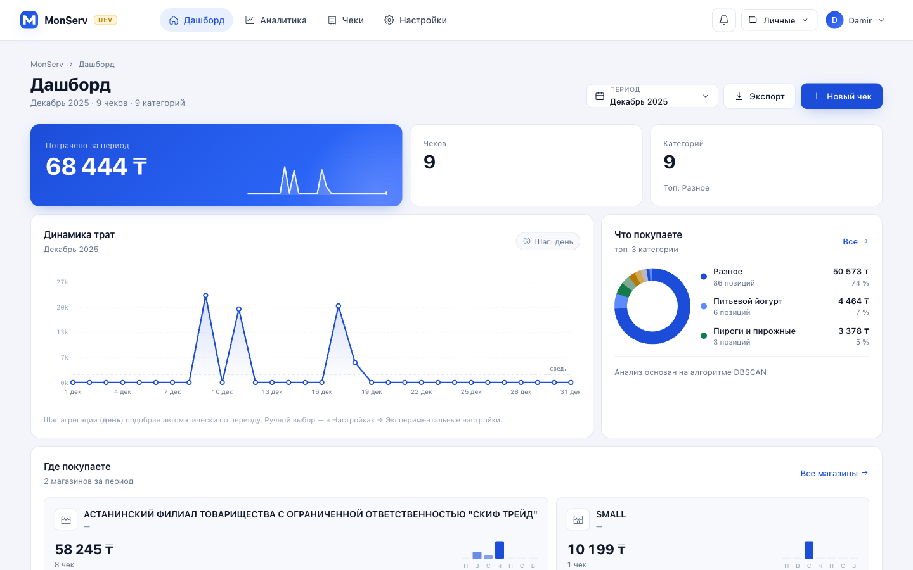
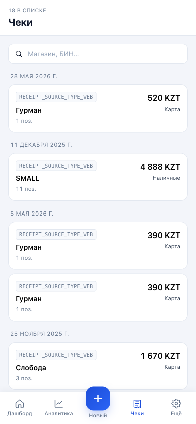
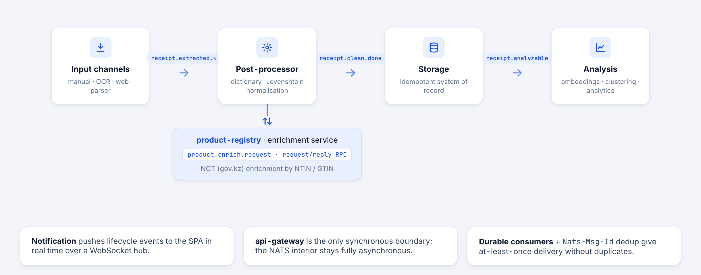

# MonServ — Receipt Storage, Analysis & Price Monitoring

> Undergraduate diploma project (group of 3) — a production-style, event-driven
> microservice system for consolidating, normalising and analysing personal retail
> spending from Kazakhstan's fiscal-receipt ecosystem.
>
> **This repository is a curated portfolio overview.** The full implementation lives
> across 15 private repositories; here I document the architecture, the engineering
> decisions, and my personal contribution, with screenshots of the running product.

| | |
|---|---|
| **Institution** | Astana IT University (AITU), School of Software Engineering |
| **Program** | 6B06102 — Software Engineering |
| **Team** | Adil Ormanov, Damir Timergazin, Yerassyl Salimgerey |
| **Supervisor** | Askar Khaimuldin |
| **Defense** | June 2026 |

---

## Problem

Kazakhstan has fully fiscalised retail: every purchase produces a structured electronic
receipt published by **Operators of Fiscal Data (OFD)** — `oofd.kz`, `wofd.kz`, `ofd1.kz` —
reachable per-receipt through QR-code URLs. The data exists, but households and small
businesses have **no convenient way to consolidate, normalise and analyse personal spending**
across stores and over time.

**MonServ** ingests receipts through three channels (manual, OCR of photos, automated parsing
of OFD URLs), normalises noisy bilingual (Russian/Kazakh) product names, clusters semantically
equivalent products and enriches them against the national goods registry, then surfaces
price/category analytics through a single-page web app.

---

## Screenshots

| Web dashboard | Receipts (mobile) |
|---|---|
|  |  |

Spending analytics with automatic semantic category grouping (DBSCAN), per-store breakdown,
and receipts ingested across all three input channels.

---

## Architecture

Microservices, **event-driven** with a message broker as the backbone. Services are
independently deployable and language-heterogeneous (polyglot Go + Python). Heavier services
follow **clean / hexagonal architecture** (`domain` / `application` / `infrastructure` /
`transport`). All inter-service messages are defined once in **Protobuf** and code-generated
for both Go and Python (**contracts-first**).

### Receipt lifecycle

**Async backbone:** NATS JetStream carries the canonical receipt-lifecycle events
(`receipt.extracted.*`, `receipt.clean.done` / `.fail`, `receipt.analyzable`).

**Storage:** PostgreSQL with the **pgvector** extension for embeddings.

**Auth:** Keycloak (OIDC + PKCE) at the edge; a dedicated `user-registry` service owns
profiles, groups and invitations and keeps Keycloak in sync (**decoupled authorization** —
group/role claims are pushed to the IdP so downstream services authorize straight from the
token, with no DB round-trip).

**Reliability — transactional outbox:** state-changing services write the domain change and
its side-effects (Keycloak sync, NATS events) into a DB outbox table **in the same
transaction** via an abstract `TransactionManager`; a background worker delivers them
at-least-once with retries and **per-aggregate FIFO ordering** — solving the dual-write
problem with no lost or divergent updates on crash.

**Delivery:** fully GitOps — a Helm chart reconciled by ArgoCD onto Kubernetes.

**Observability:** Loki + Promtail + Grafana (centralised log dashboards; error-rate,
HTTP codes, panics, live log stream), OpenTelemetry instrumentation.

---

## Services

### Input channels
- **`input-receipt-manual`** (Go, Gin, NATS) — HTTP API for manual receipt entry; validates
  and emits `receipt.extracted.*`. Swagger-documented.
- **`input-receipt-web-parser`** (Go, Gin, goquery, NATS) — fetches and HTML-scrapes OFD
  receipt pages from a QR/URL, parses items/prices, emits extracted receipts.
- **`input-receipt-ocr`** (Python, **RapidOCR**, NATS) — OCR pipeline that turns photographed
  receipts into structured data, with an **LLM correction stage** (Ollama, falling back to
  Google AI) and QR delegation to the web-parser.

### Processing & analytics
- **`postprocessor-receipt`** (Python, rapidfuzz, lingua, NATS) — product-name normalisation.
  In production the canonical RU/KK names come from the **NCT registry by NTIN/GTIN**; a
  two-pass dictionary–Levenshtein normaliser with automatic language detection is implemented
  as a configurable alternative strategy.
- **`analysis-receipt`** (Python, FastAPI, async SQLAlchemy + asyncpg, Alembic, pgvector,
  onnxruntime, scikit-learn, umap-learn) — the ML/analytics core:
  - **Embedder** — 768-dimensional **multilingual-e5** sentence embeddings via ONNX Runtime.
  - **Clusterer** — semantic product clustering with **DBSCAN** on cold recalculations;
    vectors indexed with **HNSW** in pgvector for fast nearest-neighbour lookup at ingest.
  - **Cluster namer** — assigns human-readable canonical names to clusters (LLM client).
  - Exposes analytics over HTTP and consumes `receipt.analyzable`.

### Persistence, enrichment, delivery
- **`storage-receipt`** (Go, Gin, GORM/PostgreSQL, NATS, OpenTelemetry, Swagger) — canonical
  persistence of receipts; scope-aware repositories.
- **`product-registry`** (Go, Gin, GORM/PostgreSQL, NATS) — enriches products against the
  **national goods registry NCT (`nct.gov.kz`)** by NTIN/GTIN for reference RU/KK names and
  social-status flags. Strict rate limiting (1 req/s), automatic redirect-chain resolution,
  cycle detection with oldest-item fallback, batch processing via NATS, admin API.
- **`notification`** (Go, pgx/PostgreSQL, NATS) — event-driven user notifications pushed to
  the SPA in real time over a **WebSocket hub**, plus a REST history/`read` API.

### Identity & edge
- **`user-registry`** (Go, Gin, GORM/PostgreSQL, NATS) — profiles (lazy registration on first
  authenticated request), groups and invitations (one-time tokens, 48h TTL, single-use via
  row lock). Syncs membership to the Keycloak Admin REST API. Built on a transactional outbox
  + abstract `TransactionManager` and a `scope` middleware lifting identity from gateway
  headers into context.
- **`api-gateway`** (Go, Gin, go-oidc) — BFF/gateway: validates Keycloak OIDC tokens, injects
  identity headers (`X-User-ID` / `X-Group-ID` / `X-User-Role`), performs scope-based
  authorization, routes to internal services via a discovery layer.
- **`frontend`** (React 19, Vite, react-router, axios, keycloak-js, html5-qrcode,
  framer-motion) — single-page app for uploading receipts (incl. in-browser QR scanning) and
  browsing price/category analytics. Tested with Vitest (unit) and Playwright (e2e).

### Supporting repositories
- **`contracts`** — Protobuf schemas (`receipts/v1`, `events/receipts/v1`) built with **buf**;
  the single source of truth for all messages and events.
- **`libraries`** — shared `broker` and `contracts` client libraries for Go and Python,
  published as private packages and consumed by every service.
- **`infrastructure`** — the Helm chart (`charts/diploma`), ArgoCD application manifests,
  per-environment values, and the full observability stack (Loki/Promtail/Grafana), Keycloak,
  NATS and Postgres as chart templates. CI runs `helm lint` + `helm template` validation and
  secret detection.

---

## Technology stack

**Languages:** Go, Python, JavaScript (React), SQL, Protobuf, Bash.

**Backend:** Gin, FastAPI, GORM, async SQLAlchemy + asyncpg, pgx, Alembic, goose,
swaggo (Swagger/OpenAPI), go-oidc.

**Messaging & contracts:** NATS JetStream, Protocol Buffers + buf, code-gen for Go and Python.

**Data / ML / NLP:** PostgreSQL, pgvector (HNSW vector index), multilingual-e5 embeddings via
ONNX Runtime + tokenizers, scikit-learn (DBSCAN), umap-learn, rapidfuzz, lingua language
detection, LLM client for cluster naming.

**Frontend:** React 19, Vite, React Router, Keycloak JS adapter, html5-qrcode, Axios,
Vitest, Playwright.

**Cloud-native / DevOps:** Docker, Kubernetes, Helm, ArgoCD (GitOps), GitLab CI/CD,
Keycloak (OIDC + PKCE), Grafana + Loki + Promtail, OpenTelemetry, secret detection in CI.

**Practices:** clean/hexagonal architecture, domain-driven design, contracts-first,
event-driven design, testcontainers-based integration tests, mock-based unit tests,
private package registries, semantic-versioned shared libraries, merge-request review.

---

## Engineering highlights

- A strongly-typed, **event-driven pipeline** where independent services interoperate purely
  through versioned Protobuf events on NATS JetStream — no synchronous coupling on the
  ingest/processing path.
- An applied **NLP + semantic-clustering** subsystem for noisy bilingual (RU/KK) product
  names: registry-backed canonicalisation, transformer embeddings served via ONNX, HNSW
  approximate nearest-neighbour search in pgvector, DBSCAN re-clustering.
- A rate-limited, fault-tolerant connector to a **government registry** with redirect-chain
  resolution and cycle detection.
- End-to-end **OIDC/PKCE authentication and scope/group-based authorization**
  (Keycloak ↔ gateway ↔ services ↔ SPA), with decoupled authorization via Keycloak Admin sync.
- The **dual-write problem** solved with a transactional outbox: an abstract
  `TransactionManager` (DB transaction hidden in `context`, no ORM leak into the service
  layer) writes domain changes and side-effects atomically; an outbox worker delivers them
  at-least-once with per-aggregate FIFO ordering. Concurrency hardening: row-level locks
  (`SELECT … FOR UPDATE`) for single-use invitation tokens, `ON CONFLICT` upserts for lazy
  registration.
- A complete **GitOps platform**: Helm-templated cluster (services, Postgres, NATS, Keycloak,
  full Loki/Promtail/Grafana observability) reconciled by ArgoCD, with CI validation and
  centralised log dashboards.

---

## My contribution

MonServ was built by a team of three, and I worked hands-on across the **entire system** —
from data collection and the backend pipeline through the ML layer to the front-end and the
product design:

- **Backend microservices (Go)** — canonical receipt persistence (`storage-receipt`),
  identity / groups / invitations on a transactional outbox + `TransactionManager`
  (`user-registry`), manual ingest (`input-receipt-manual`), the realtime WebSocket
  notification service (`notification`), the API gateway, and the shared `scope` identity
  layer used across HTTP and NATS.
- **Post-processing & NLP** — the product-name normalisation service: language detection and
  registry-backed (NCT/NTIN) canonicalisation of noisy bilingual (RU/KK) product names.
- **Machine learning & analytics** — the embedding and clustering pipeline (multilingual-e5
  via ONNX Runtime, pgvector/HNSW nearest-neighbour search, DBSCAN re-clustering) and the
  analytics aggregation behind the dashboards.
- **Data collection** — assembled the real-world receipt dataset from OFD/QR sources used to
  develop and validate ingestion, parsing and the ML pipeline.
- **Front-end** — the React SPA for uploading receipts (including in-browser QR scanning) and
  browsing the price/category analytics.
- **Design** — the product UI/UX (Figma) behind the SPA.
- **Reliability & testing** — transactional outbox / at-least-once delivery with per-aggregate
  ordering, and testcontainers-based integration test suites across services; surfaced and
  fixed broker and identity-propagation bugs along the way.
- Co-authored the **LaTeX thesis** and the system documentation.

> MonServ is a team project; the points above reflect my hands-on involvement across its
> subsystems rather than sole authorship of any one of them.

---

## Note on this repository

For academic-integrity and security reasons this overview intentionally **does not** include
deployment secrets, credentials, private package contents or the full source. It is published
with the consent of all team members as a portfolio reference.
